# 🔌 Compiler Internals (Curium 5.0)

Curium transpiles to C11. This requires multiple distinct internal architectural modules heavily relying on the core `ast_v2.h` tree system.

## 0. Full Pipeline Overview

```mermaid
flowchart TD
    A[Source .cm] --> B(Lexer);
    B --> C(Parser);
    C --> D[AST v2 Arena Allocator];
    D --> E(Type Checker);
    E --> F(Codegen);
    F --> G[C11 Source];
    G --> H(TCC Backend);
    H --> I((Executable Binary));

    subgraph "Phase 2 DOD Arena"
        D
    end
    
    style A fill:#1c1c1c,stroke:#fff
    style I fill:#1c1c1c,stroke:#2bff77
```

## 1. The Preprocessor & Lexer
Located in `src/compiler/lexer/lexer.c`, the raw text passes through an immediate tokenization function parsing out string literals, whitespace, polyglot `c { ... }` blocks, and resolving token chains against `include/curium/compiler/tokens.h`.

## 2. The Multi-Pass Parser & Phase 2 DOD Arena (AST v2)
The tokenized array is mapped rapidly onto the `curium_ast_v2_node_t` struct graph.
- **Phase 2 DOD Arena Allocator**: In v5.0, nodes are NOT individually `malloc`'d anymore. Instead, the parser uses a global module context arena (`curium_parse_arena` based on `curium_ast_arena_t`). This means the entire AST is destroyed in O(blocks) time rather than O(nodes), drastically speeding up the lex-parse lifecycle.
- Every node operates via unionized memory states depending on `curium_ast_v2_kind_t`.
- Polyglot nodes inject unparsed strings to directly insert verbatim outputs into the Codegen phase.

## 3. The Type Checker
To provide static safety despite dynamic operations, semantic resolution occurs throughout `typecheck.c`.
Features like `strnum` are hardwired to gracefully allow numeric mutations alongside standard string concatenation checks, resolving into standardized internal string formats dynamically while checking bounds.

## 4. C11 Codegen Generation
The heart of Curium translates the AST directly to standard C99/C11 syntax using standard string builder architectures:
- C variables mapped directly directly to `.c` mappings.
- Output file typically emitted to `.cache/curium_out.c`.

## 5. TCC/GCC Linking
Finally, CMake builds or native compiler commands invoke system-available hooks mapping the output `.c` against `src/runtime/*.c` (the Curium SDK libraries: `map.c`, `project.c`, `oop.c`). In Version 5, the CLI deeply integrates `TCC` natively yielding blazingly-fast linking cycles.

## 6. The `cm doctor` Diagnostic Subsystem
Curium isn't just a compiler compiler, it actively protects project state. The embedded subsystem routinely runs Health Scans across:
* `curium.json` syntax validation.
* Syntax validations against missing src directories.
* Bare un-encapsulated `malloc`/`free` calls strictly prohibiting unchecked access unless explicit C integration commands are passed.
* Real-time checks for C-Compiler tooling (GCC/Clang/TCC).
